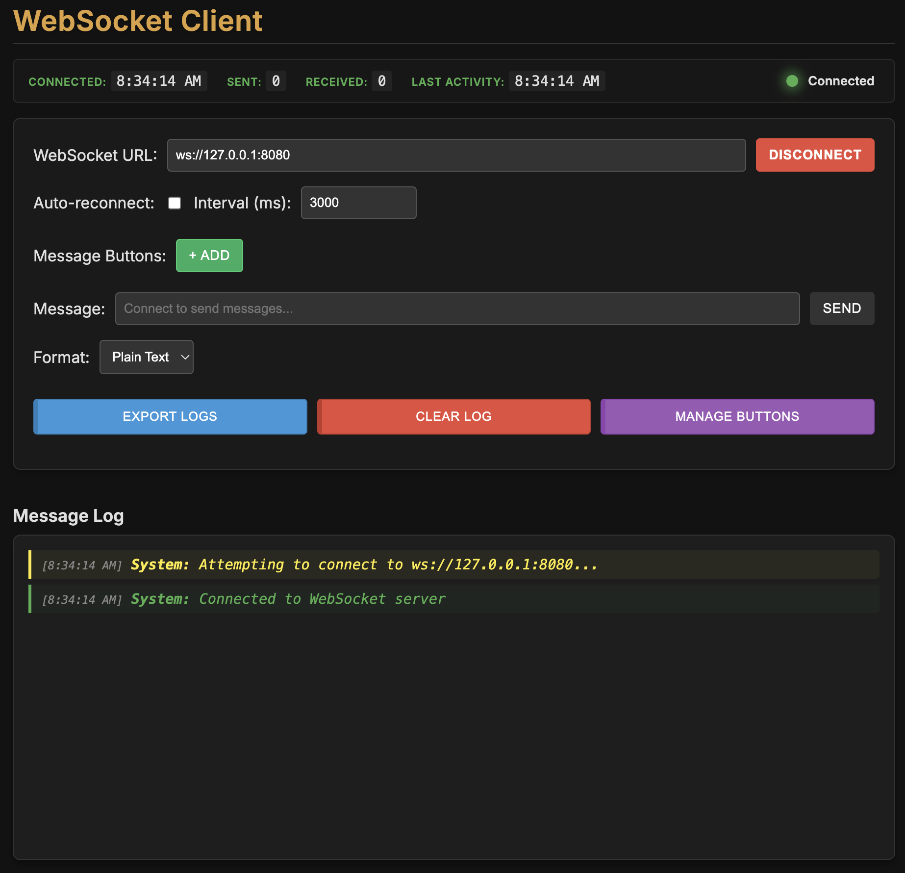

# WebSocket Client

A modern, feature-rich WebSocket client application with a clean and intuitive user interface. This client allows you to establish WebSocket connections, send/receive messages, and manage predefined message buttons for quick interactions.

## Features

- **Real-time Connection Management**
  - Connect to any WebSocket server using ws:// protocol
  - Auto-reconnect functionality with configurable intervals
  - Visual connection status indicator
  - Detailed connection statistics

- **Message Handling**
  - Send and receive WebSocket messages
  - Support for both plain text and JSON message formats
  - Message history navigation using arrow keys
  - Pre-defined message buttons for quick actions

- **User Interface**
  - Clean, modern dark theme design
  - Real-time connection status indicator
  - Message log with timestamps
  - Connection statistics display

- **Message Button Management**
  - Create, edit, and delete custom message buttons
  - Save buttons for future sessions
  - Quick access to frequently used messages

- **Utility Features**
  - Export message logs to text file
  - Clear message log
  - Persistent settings across sessions

## Usage

1. **Connection Setup**
   - Enter the WebSocket server URL in the format `ws://IP:PORT`
   - Click "Connect" to establish connection
   - Optional: Enable auto-reconnect with custom interval

2. **Sending Messages**
   - Type message in the input field and press Enter or click Send
   - Use predefined message buttons for quick actions
   - Select message format (Plain Text/JSON)

3. **Managing Message Buttons**
   - Click "+ Add" to create new message buttons
   - Use "Manage Buttons" to edit or delete existing buttons
   - Click saved buttons to quickly send predefined messages

4. **Utility Functions**
   - Use "Export Logs" to save message history
   - Use "Clear Log" to reset the message display
   - Use "Manage Buttons" to organize predefined messages

## Technical Details

- Built with vanilla JavaScript
- Uses WebSocket API for real-time communication
- Implements local storage for settings persistence
- Responsive design with modern CSS

## Getting Started

1. Download the HTML file
2. Open it in a modern web browser
3. Enter your WebSocket server URL
4. Start communicating!

## Browser Compatibility

This application works with all modern browsers that support:
- WebSocket API
- Local Storage
- CSS Grid/Flexbox
- ES6+ JavaScript

## License

This project is open source and available under the MIT License.
